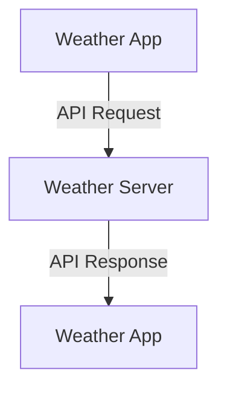

# Api
Notes on api

An API (Application Programming Interface) is a set of rules that lets one piece of software talk to another. It defines what you can ask for, how to ask, and what you'll get back, without you needing to know how the other system works internally.

A common analogy is a restaurant. You (the app) don't walk into the kitchen. You give your order to a waiter (the API), who passes it to the kitchen (the server or system) and brings back your food (the response).

Example: A weather app on your phone doesn't collect weather data itself. It sends a request to a weather service's API, something like "give me today's forecast for Pune," and gets back structured data (usually JSON) that the app then displays.

The response might look something like:

{
  "city": "Pune",
  "temperature": 28,
  "condition": "Cloudy"
}

<b>Why do we need APIs?</b>
